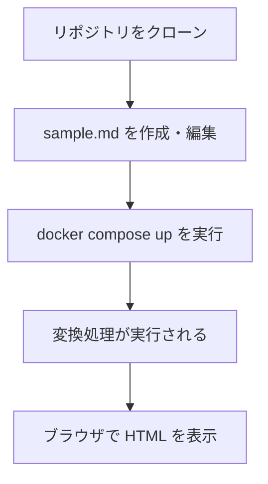
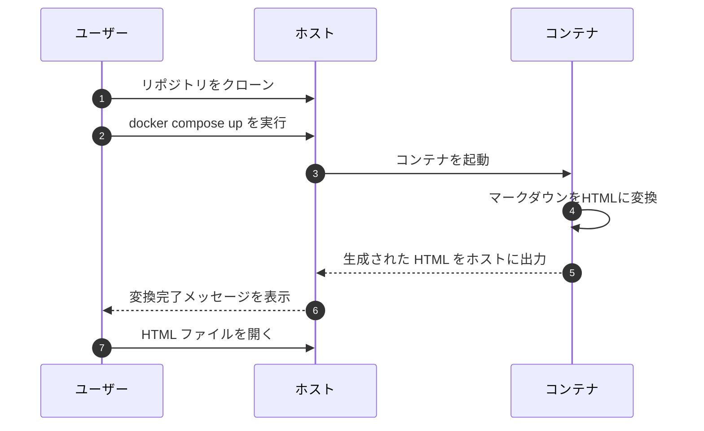

# Markdown to HTML Converter


### Markdown を HTML へ変換するシステム


<br>

## ⭐ デモ画像


### Markdown を HTML へ変換するデモ画像

<br>


<br>

## **📝 サービス紹介と導入ガイド**
- [サービスの特徴・開発の目的](#サービスの特徴・開発の目的)

- [セットアップ手順](#セットアップ手順)

- [基本的な使い方](#基本的な使い方)

<br>

## **🛠 技術構成**

- [システム全体の構成図](#システム全体の構成図)

- [使用技術](#使用技術)


<br>

## **📚 出典・ライセンス**

- [参考文献](#参考文献)

- [ライセンス情報](#ライセンス)

<br>

---

## <a id="サービスの特徴・開発の目的"></a> 📝 サービスの特徴・開発の目的

<br>

###  サービスの全体像

- このプロジェクトは、**マークダウンをHTMLに変換するシステム**です。

- `docker compose up` コマンドだけで環境構築から変換処理まで自動で行います。


<br>

### できること

- **マークダウン → HTML 変換**  
  
  `.md` ファイルを読み込み、対応する `.html` ファイルを自動生成します。

- **コンテナ起動**  
  
  docker compose up コマンドで環境構築から変換実行までを一気に行います。

- **ファイル共有**  
  
  ホストとコンテナでフォルダを共有し、変換後のファイルをすぐに確認できます。


<br>

### 作成のきっかけ

1. **課題意識**

   マークダウンを手動でHTMLに変換するのは、手間がかかってミスも多い

2. **解決アプローチ**

   Python の `markdown` ライブラリで自動変換 して Docker Compose で環境構築と実行を一度に実現

3. **得られた学び**

   Markdown 変換機能と Docker のベストプラクティスを習得し、CI/CD を見据えた設計を行いました

<br>


---

## <a id="セットアップ手順"></a> 🚀 セットアップ手順

<br>

### 1. 前提条件 

以下を事前にインストールしてください

- [Git](https://git-scm.com/)

- [Docker](https://docs.docker.com/get-docker/)

<br>

### 2. リポジトリのクローン

以下のコマンドをターミナルで実行します

```bash
git clone git@github.com:BackendExplorer/Markdown-to-HTML-Converter.git
```

```bash
cd Markdown-to-HTML-Converter
```

<br>

---


## <a id="基本的な使い方"></a>🧑‍💻 基本的な使い方

<br>

### 1. コンテナ起動

Docker Desktopを起動したら、ターミナルを開いて、以下のコマンドでコンテナを起動します。


```bash
docker compose up
```

<br>

### 2. ユーザーの操作手順

<br>

以下の手順でマークダウンをHTMLに変換できます。




---


## <a id="システム全体の構成図"></a>🔄 システム全体の構成図

<br>



<br>


<br>

---

## <a id="使用技術"></a>🧰 使用技術

<br>

### 技術選定の理由

- **`Python`**
  
  豊富な標準ライブラリと高い可読性によって、複雑なシステムを効率的に実装するため
  

- **`Docker`**

  依存関係をコンテナ内に隔離し、環境差異を排除してどこでも同じ動作を保証するため

- **`Docker-Compose`**

  サーバコンテナとクライアントコンテナを同時に起動し、起動手順を簡素化するため

<br>

| カテゴリ       | 技術スタック                                                                 |
|----------------|------------------------------------------------------------------------------|
| 開発言語       |  |
| ライブラリ       |  |
| 開発環境       | &nbsp;&nbsp;&nbsp;&nbsp; |
| バージョン管理 | &nbsp;&nbsp;&nbsp;&nbsp; |
| インフラ |   |
| 描画ツール     | &nbsp;&nbsp;&nbsp;&nbsp; |

<br>

---

## <a id="参考文献"></a>📗 参考文献

<br>

### 公式ドキュメント

- [Python-Markdown - Markdown 変換ライブラリ](https://python-markdown.github.io/)

  .md ファイルを HTML に変換する方法を参照

- [Docker - コンテナ](https://docs.docker.com/)

  コンテナのビルドと実行手順を参照

- [Docker Compose - サービス定義](https://docs.docker.com/compose/)

  コンテナの起動方法を参照

<br>

---

## <a id="ライセンス"></a>📜 ライセンス情報

<br>

<ul>
  <li>
    本プロジェクトの全コード・構成・図・UIなどの著作権は、制作者である Tenshin Noji に帰属します。<br><br>
    採用選考や個人的な学習を目的とした閲覧・参照は歓迎しますが、<br><br>
    無断転載・複製・商用利用・二次配布は禁止とさせていただきます。<br><br>
    ライセンス全文はリポジトリ内の <a href="./LICENSE.md" target="_blank">LICENSEファイル</a>をご覧ください。
  </li>
</ul>

<br>
